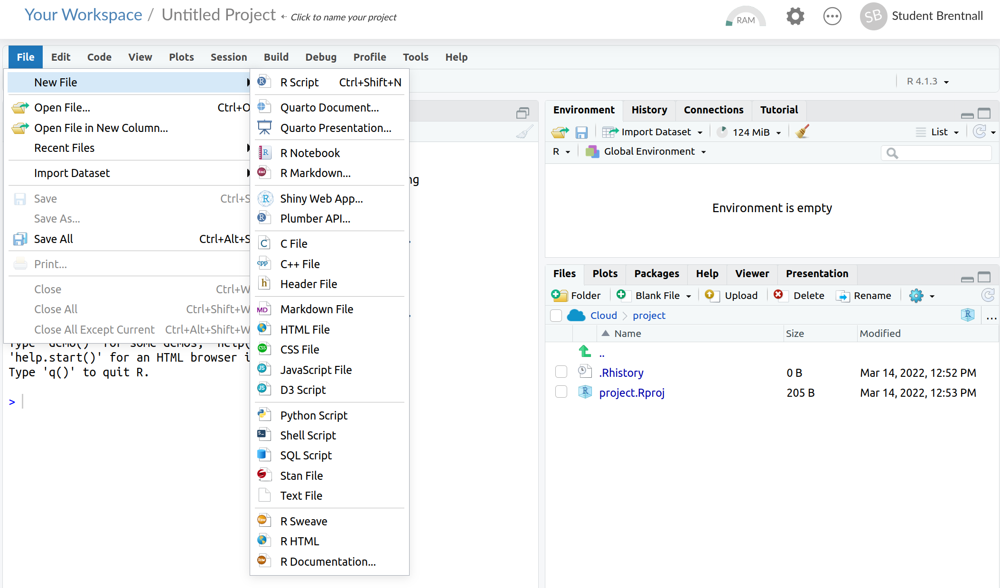
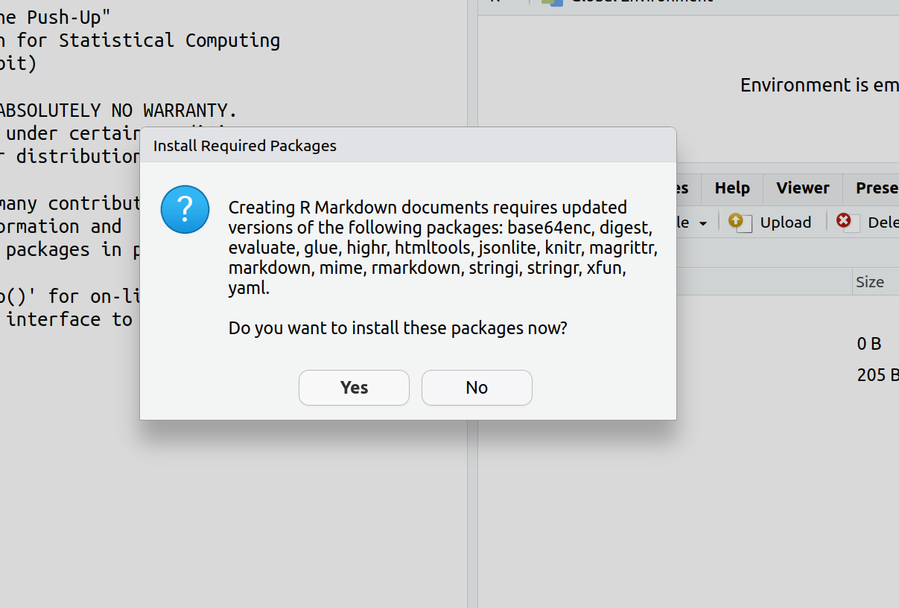
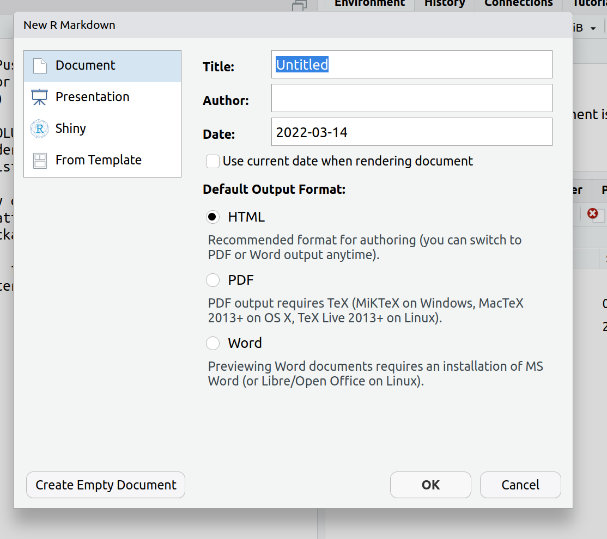
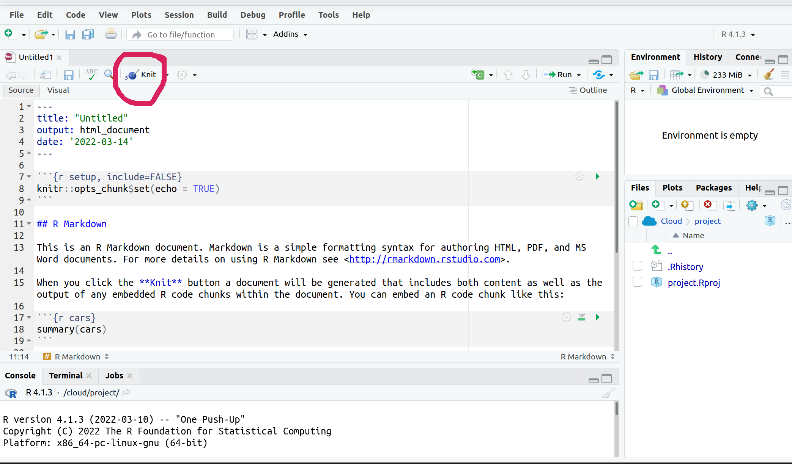
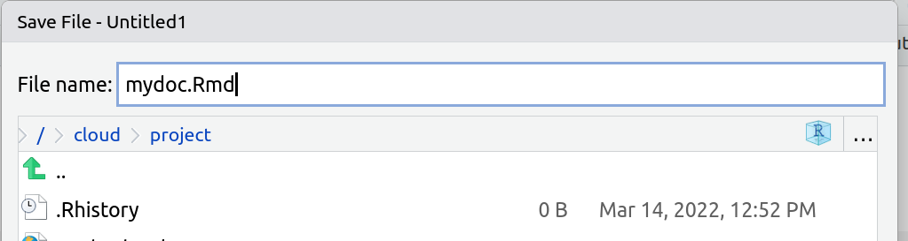
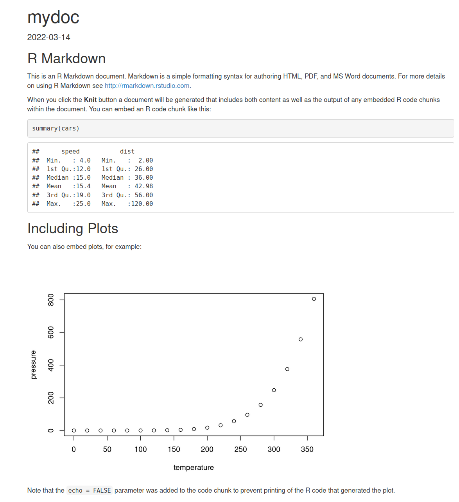
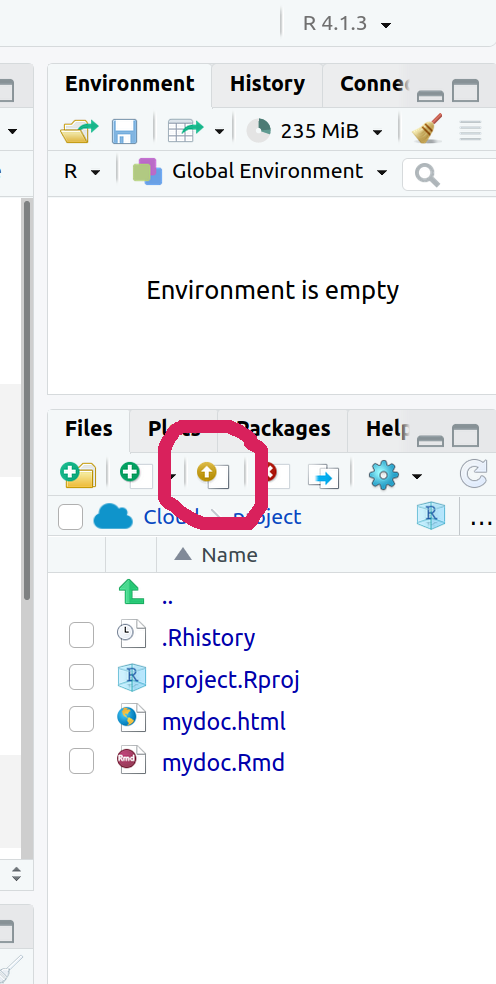
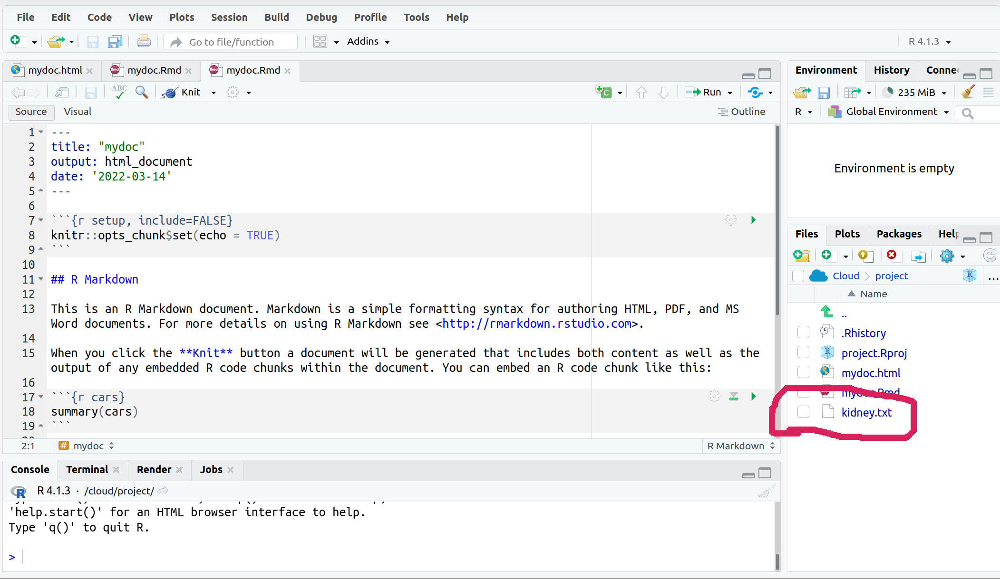

# Pre-tutorial instructions

## Before the tutorial..

- Watch an overview on what R markdown is for (4m)
  - https://youtu.be/ZzDSkBgt9xQ
- Set up an account on RStudio Cloud 
  - https://rstudio.cloud
- Download a data file to your PC for use in session 
  - http://web.stanford.edu/~hastie/CASI_files/DATA/kidney.txt

- Session assumes you are familiar with R. If not, try two tutorials:
  - http://mybinder.org/v2/gh/brentnall/r-intro-tutorial/master?urlpath=shiny/tutorial1/Intro.Rmd
  - http://mybinder.org/v2/gh/brentnall/r-intro-tutorial/master?urlpath=shiny/tutorial2/DataAnal.Rmd

# Tutorial


## R Markdown tutorial

* Aim: develop an R markdown document using some data
  + Assume use R already
* Will use RStudio Cloud in this session
  + Create account here: https://rstudio.cloud 

## Overview

* R markdown: a way to write documents that integrate R code
  + Text written in markdown
  + Stats code in R
* In this session you will do some tasks
  + Introduce in group 
  + Then you work on your own (in breakouts for peer support if needed)
  + Review in group, then next task

# Task 1: create a markdown file and knit it

## Step 0: Set up RStudio Cloud

- Go to https://rstudio.cloud 
- Create account
- Create new Rstudio project

## Step 1: create Rmd file using default from RStudio
- File > New File > R Markdown
{width=100%}


## Step 2: install libraries (if asked)

{width=100%}


## Step 3: choose type (use default)

{width=100%}


## Step 4: view the markdown file code, and knit it (generate document)

{width=100%}


## Step 5: after clicking knit, give filename to save (if needed). 

{width=100%}

## Step 6: View the rendered document

{width=100%}


## Step 7: review markdown file vs document

* Hash symbols `#` in the code define headers;
- R code is in chunks. These always start with ` ```{r`
- The simplest is ` ```{r} ... ``` `.  
- The R chunks in the document you created include names (eg. ` ```{r cars}` where `cars` is a name that you can choose. Naming chunks can be useful for debugging 

## Questions / discussion

# Task 2: Load your own data into the markdown document you have created 

## Step 1: Download data to your PC

- Data from the nephrology laboratory of Dr. Brian Myers, Stanford University (http://web.stanford.edu/~hastie/CASI_files/DATA/kidney.txt)
  - download this file to your computer by following link
- Aim to quantify kidney funciton vs age
- 157 healthy volunteers were recruited
- Will generate an Rmarkdown document

## Step 2: Load data into RStudio Cloud project (from file you downloaded to your PC)

{height=100%}


## Step 3: Check the data are loaded

{width=100%}


## Step 4: Edit your markdown file to load the data and show the first few rows

- To start your document, I suggest to delete all the code ***below*** ``## R Markdown`` in the code (or add your code below the current code) 

- Then create an R segment to load the kidney data using ` ```{r} ... ``` `, by including the following R code 

```{r, eval=FALSE}
mydta<-read.csv("kidney.txt", sep=" ") ##load txt file 
head(mydta) ##print out first few rows
```
- You may knit the file to view the document

## Step 5: Edit your markdown code so that the R commands are not shown in the rendered document 
- Can run code without showing it, but displaying the output, by using `echo=FALSE` in the start of the code chunk.

- Task: repeat the code but now show the output but not the code by using ` ```{r, echo=FALSE} ` at the start of the chunk (the difference is `echo=FALSE`).

## Step 6: Edit your markdown code so that the R commands and R output are hidden in the rendered document
- We can run code without presenting anything in the document by using `include=FALSE` in the start of the code chunk.
- Task: repeat your code to load the data but do not show output or the code by using ` ```{r, include=FALSE} ` at the start of the code chunk


```{r, include=FALSE}
mydta<-read.csv("kidney.txt", sep=" ") 
head(mydta) ##print out first few rows
```

```{r libraries, include=FALSE}

library("tidyverse")

library("knitr")


```

## Task 2: Questions / discussion

# Task 3: Present summary statistics in your markdown document

## Step 1: Print out as seen in R

- You may print out to your document R output using a simple ` ```{r} ... ``` ` chunk.
- Task: Add the following code below where you loaded the data and knit the document
```{r, eval=FALSE}
summary(mydta) 

```
## Step 2: Display a table

- An alternative approach is to format as a table. One function that does this is `kable()`. 
- Task: Use the `kable()` function to format the summary statistics as a table, starting the chunk ` ```{r results='asis'} `.

```{r results='asis', eval=FALSE}                                                        
kable(summary(mydta), caption="", align='r', row.names=FALSE)

```
## Step 3: Display a bespoke table

- You can create any table you like in this way. 
- Task: Try including the following code and knit your document

```{r results='asis', eval=FALSE}                                                        

mytab<-rbind(quantile(mydta$age), quantile(mydta$tot))
rownames(mytab)<-c("Age", "Kidney function")
kable(mytab, caption="Quantile of age and kidney function",
      align='r', row.names=TRUE)

```
- (Recall if you do not wish to display the code in your document then add `echo=FALSE` to the chunk start, eg. ` ```{r results='asis',echo=FALSE} `.)


## Task 3: Questions / discussion

#  Task 4: Add some plots to your markdown document

## Step 1: Add a scatter plot of age vs kidney function

- Task: add the following command in a plain `r` chunk and render the document

```{r, eval=FALSE}

plot(mydta$age, mydta$tot, xlab="Age (y)",
     ylab="Measure of kidney function")

```
## Step 2: Display a chart or figure by loading a graphics file 

- Task A: Save scatter plot as a png file in an `r` chunk

```{r, eval=FALSE}
png("myplot.png")
plot(mydta$age, mydta$tot, xlab="Age (y)",
     ylab="Measure of kidney function")
dev.off()

```
- Task B: Add the png file as a figure to the markdown text (outside and R code chunk) through

 ` `

- Knit the document and check it is visible


## Task 4: Questions / discussion

# Conclusion

## Summary
- R Markdown lets you combine your code into a report in a reproducible manner
- Can hide or show what you like in the report
- Can create much more than documents (this presentation done in Rmarkdown too)


## Further resources

- Video overview (4m)
  - https://youtu.be/ZzDSkBgt9xQ
- RStudio docs
  - https://rmarkdown.rstudio.com/
- Reference book
  - https://bookdown.org/yihui/rmarkdown
- Cheat sheet
  - https://rmarkdown.rstudio.com/lesson-15.html


# Task 5: Homework! Some more analysis

## Step 1: Fit a linear model to the data and print out a summary showing R code in your document

- Task: Add the following chunk and knit your document

```{r, eval=FALSE}
myreg<-lm(tot~age, mydta)
summary(myreg)
```

## Step 2: Displaying summary statistics in the text without copying and pasting them

- Task A: calculate and save confidence interval on slope from the linear model in an `r` chunk

```{r, eval=FALSE}
myci<-format(round( cbind( coef(myreg), confint(myreg)),3), nsmall=3)
mycitxt<-paste0(myci[2,1], " (95%CI", myci[2,2], " to ",
                myci[2,3], ")")

```
- Task B: include the confidence interval in the markdown text by adding 

\` ` r mycitxt` \` 

- Knit the document to check it worked


## Step 3: Add some plots from the linear model fit to your report

- Task: Show these plots in your report using techniques shown above

```{r, eval=FALSE}
## Residuals 
plot(myreg,1)
plot(myreg,2)

```
