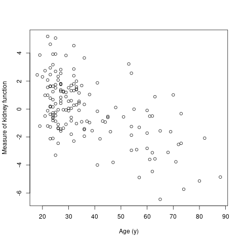

<!-- This text is a comment and will not appear in the document that is created from this file. Please use RStudio Cloud, or RStudio on your computer to complete this tutorial.  -->

# Scenario

In this Rmarkdown document we conduct a linear regression analysis using some data from the nephrology laboratory of Dr. Brian Myers, Stanford University. The data are available from https://web.stanford.edu/~hastie/CASI_files/DATA/kidney.txt . They are used as an example in the book "Computer age statistical inference" by Efron and Hastie, which is freely available [here](https://web.stanford.edu/~hastie/CASI/).

The research question to be addressed is to quantify how healthy the kidney of a potential donor is likely to be given their age. 

157 healthy volunteers (potential donors) were recruited, and measures of kidney function and their age were recorded. The kidney function measure is a continuous variable that has been normalised to have mean zero; higher values correspond to better kidney function. Age in years is at the same time when kidney function was measured.

# Analysis

## Part 1: loading libraries and data

Including code using `{r}` is the easiest way to include code. It means that all code and output will appear in the document. You may not always want this, and there are options you can give to hide the code and / or output from R.


- Include code and output
```{r}
mydta<-read.csv("kidney.txt", sep=" ") #columns separated by whitespace, not commar
head(mydta) ##print out first few rows
```
- Include output not code (`echo=FALSE`)
```{r, echo=FALSE}
mydta<-read.csv("kidney.txt", sep=" ") #columns separated by whitespace, not commar
head(mydta) ##print out first few rows
```
- Include neither, but code runs (`include=FALSE`)
```{r, include=FALSE}
mydta<-read.csv("kidney.txt", sep=" ") #columns separated by whitespace, not commar
head(mydta) ##print out first few rows
```

We can load libraries without presenting anything in the document by using `include=FALSE` in the start of the code chunk.

```{r libraries, include=FALSE}

library("tidyverse")

library("knitr")
```

## Part 2: summary statistcs - some ways to present them in the document

By printing out R output:
```{r}
summary(mydta) 

```
By putting R output into a table:
```{r echo=FALSE, results='asis'}                                                        
## echo = FALSE means the code does not appear by the output (here a table) will
## results='asis' needed for the table formatting using kable() function
kable(summary(mydta), caption="", align='r', row.names=FALSE)

```

By using bespoke table
```{r echo=FALSE, results='asis'}                                                        

mytab<-rbind(quantile(mydta$age), quantile(mydta$tot))
rownames(mytab)<-c("Age", "Kidney function")
kable(mytab, caption="Quantile of age and kidney function", align='r', row.names=TRUE)

```

## Part 3: Plots

### Task: Create a scatter plot of age vs kidney function

One way to include the plot is to just write the command in a `r` chunk

```{r}

plot(mydta$age, mydta$tot, xlab="Age (y)", ylab="Measure of kidney function")

```

Another way is to save as a graphics file (eg. png) and then include in the text.

```{r, results='hide'}
png("myplot.png")
plot(mydta$age, mydta$tot, xlab="Age (y)", ylab="Measure of kidney function")
dev.off()

```



## Task 4: Some statistical analysis 

### Task: calculate the Pearson correlation between the two variables without showing RR code

```{r, echo=FALSE}
cor.test(mydta$age, mydta$tot)
```
## Linear regression

### Task: Fit a linear model to the data and print out a summary showing R code

```{r}
myreg<-lm(tot~age, mydta)
summary(myreg)
```

#### Question: What is the confidence interval on the rate of decline for every 10y or age?
*Code*
```{r, include=FALSE}
myci<-format(round( cbind( coef(myreg), confint(myreg)),3), nsmall=3)

mycitxt<-paste0(myci[2,1], " (95%CI", myci[2,2], " to ", myci[2,3], ")")

```
Include confidence interval results on age coefficient here: `r mycitxt`.

### Fitted linear regression plot


```{r, echo=FALSE}
##Scatter plot
plot(mydta$age, mydta$tot, xlab="Age (y)", ylab="Measure of kidney function")
## Regression line
grid()
abline(myreg, col="red")
## Confidence intervals
newx <- seq(1, 90, by=0.2)
conf_interval <- predict(myreg, newdata=data.frame(age=newx), interval="confidence",level = 0.95)
lines(newx, conf_interval[,2], col="blue", lty=2)
lines(newx, conf_interval[,3], col="blue", lty=2)
```

### Goodness of fitk

```{r, echo=FALSE}
## Residuals 
plot(myreg,1)
```

This is a plot of residuals (observed minus fitted) against the fitted value of kidney function.

```{r, echo=FALSE}
## QQ plot 
plot(myreg,2)

```
