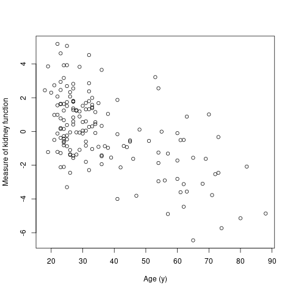
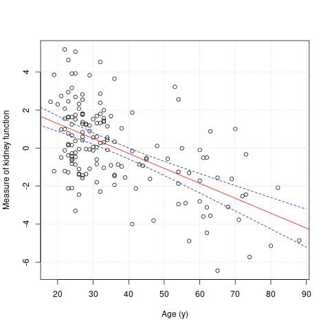
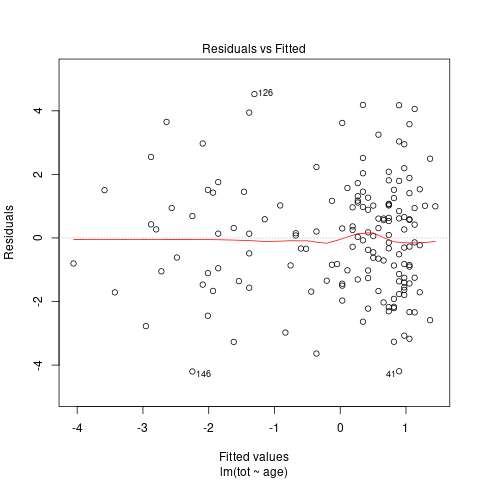
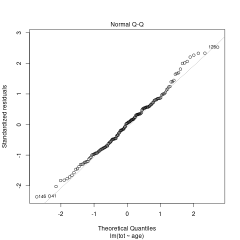

# Kidney function

In the next example we use data on Kidney fitness. We have seen these data previously in class (regression and correlation). They consist of measurements on 157 healthy volunteers (potential donors). These data originated in the nephrology laboratory of Dr. Brian Myers, Stanford University, and are available from https://web.stanford.edu/~hastie/CASI_files/DATA/kidney.txt . It is used in the book "Computer age statistical inference" by Efron and Hastie, which is available [here](https://web.stanford.edu/~hastie/CASI/). The data are loaded, the first few rows printed out and then plotted below.

```{r}
mydta<-read.csv("kidney.txt", sep=" ") #columns separated by whitespace, not commar
head(mydta)
```

```{r}
png(file="plot-kidney.png")
plot(mydta$age, mydta$tot, xlab="Age (y)", ylab="Measure of kidney function")
dev.off()
```



The above plot shows that kidney function decreases with age. The rate of decline is important in kidney transplantation: younger donors are preferred. What is the estimated rate of decline with age? The code below fits a linear regression to find out and prints out the summary and estimated confidence intervals for the regression parameters.

```{r}
myreg<-lm(tot~age, mydta)
summary(myreg)
round(confint(myreg)*10,2)
```

The output shows that the measure of kidney function declines by approximately 0.8 units (95%CI 0.61 to 0.96) for every 10 years of age.
    
We can use the model to work out the expected kidney function for person aged 70y by working through the formula. i.e. 2.86 - 0.079 * 70, or use a direct code as below.

```{r}
round(predict(myreg, newdata=data.frame(age=70)),1)
```

This prediction (-2.6) is based on fitting a straight line to the data. Is this justified? Some plots are next used to investigate the *goodness of fit* of the model. First we plot the data and estimated regression line (plus minus 95% confidence interval):,

```{r}
png('plot-kidney-reg1.png')
plot(mydta$age, mydta$tot, xlab="Age (y)", ylab="Measure of kidney function")
grid()
abline(myreg, col="red")
newx <- seq(1, 90, by=0.2)
conf_interval <- predict(myreg, newdata=data.frame(age=newx), interval="confidence",level = 0.95)
lines(newx, conf_interval[,2], col="blue", lty=2)
lines(newx, conf_interval[,3], col="blue", lty=2)
dev.off()
```



From visual inspection a straight line seems OK. Next we add code for the other diagnostic plots mentioned in class. 

```{r}
## Standard R diagnostic plots for linear regression
png("plot-kidney-reg2.png")
plot(myreg,1)
dev.off()

png("plot-kidney-reg3.png")
plot(myreg,2)
dev.off()
```

The first one is a plot of residuals (observed minus fitted) against fitted.



There is little to indicate lack of fit in this plot. The red line closely tracks 0 on the y-axis, and the spread of the data points is quite constant.

The other plot previously used to assess goodness of fit is the QQ plot. Recall this is used to assess Normality of residuals (does the plot look like a straight line?)



Again, this does not show a substantial lack of fit. 

Overall, this analysis based on visual inspection of some plots suggests that a straight line is a reasonable model fit.

Thus far we have quantified the conditional association between age and kidney function through a linear regression. We might also measure the relationship through a correlation coefficient.

Pearson correlation is:

```{r}
cor.test(mydta$age, mydta$tot)
```

Spearman correlation is:

```{r}
cor.test(mydta$age, mydta$tot, method="spearman")
```

