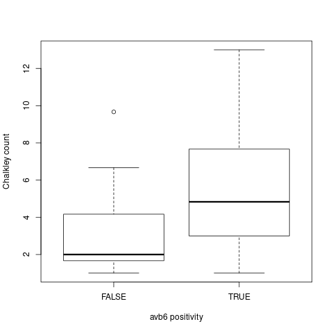
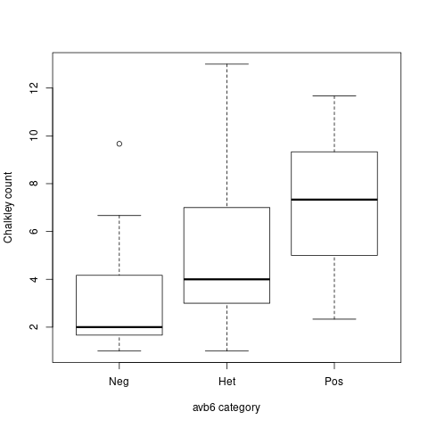

# Data

Data are from a breast cancer study and results from experiments to assess the relationship between microvessel density (as measured by "Chalkley count") and a biomarker called avb6. The code below loads the data and prints out the names of the columns. We have seen these data in class (two-sample continuous data tests).

```{r}
##load avb6 data
mydta=read.csv("181008-classdta.csv")
colnames(mydta)
```


The data for our analysis has four columns

1. **B6**: a binary (TRUE/FALSE) indicator variable, for *avb6 positivity*
1. **B6t**: a three level variable for *avb6 level* (0 = negative, 1 = heterogeneous, 2 = positive)
1. **CHALKLEY** the main variable of interest: *Chalkley count*
1. **GRADE** histological *grade* of the cancer (coded as 0,1,2)

The main interest of the analysis is to assess the association between *avb6* and *Chalkley count*. 

We would also like to understand the relationship between *avb6* and tumour *grade* (an established prognostic factor for breast cancer).

# Look at basic features of the data first


In an analysis it is important to first have a look at fundamental aspects such as the number of samples overall and in different groups, as well as overall summary statistics mean, median, inter-quartile range. This is partly because it will help to identify if there are issues such as missing data, or something has gone wrong with the data import.

```{r}
## look at data first few rows using head() function
head(mydta)
```

How many are avb6 positive?

```{r}
table(mydta$B6)
```

Of the 62 positive, how many are heterogeneous?

```{r}
table(mydta$B6t)
```

48/62 were heterogenous for avb6. What is the range of Chalkely count, mean, overall?

```{r}
summary(mydta$CHALKLEY)
```

How many are in the different tumour grade categories?

```{r}
#Number in each GRADE category
table(mydta$GRADE)
```

i.e. Most of the sample are in the highest category.

# Comparing independent samples

We next consider some statistical analysis methods to compare independent samples, to assess whether there are differences between the distribution of (the same) numerical variable between the groups. In our example we wish to compare Chalkley count by avb6 positivity. The methods we present next are applicable when:

1. The groups are independent [**A1**]. 
1. The observations within each group are independent [**A2**].

**Independence** between two units of analysis occurs when the outcome for each does not depend on the outcome of the other. For example, if you roll a die twice the value of the second roll does not depend on the first: the two are independent. An example where this is not true is when measurements are made on the same unit more than once. For example, we measure blood pressure on John today and tomorrow; an example of paired data.


## Some plots

A good way to look for difference in distribution between two groups when the outcome is a continuous variable is to use a boxplot. The below code creates two boxplots and saves them as png files.

```{r}
## Chalkley by avb6 positivity
png(file="charts/box1.png")
boxplot(split(mydta$CHALKLEY, mydta$B6), xlab="avb6 positivity", ylab="Chalkley count")
dev.off()

## Chalkley by avb6 trend
png(file="charts/box2.png")
boxplot(split(mydta$CHALKLEY, mydta$B6t), names=c("Neg", "Het", "Pos"), ylab="Chalkley count", xlab="avb6 category")
dev.off()
```



The above plot shows Chalkley count by avb6 positivity (n=32 negative, 64 positive). Summary statistics in these groups are:

```{r}
tapply(mydta$CHALKLEY, mydta$B6, summary)
```

for example, the mean is 5.43 in the avb6 positive group, vs 2.96 in the avb6 negative group. 

We now break positivity down further by negative, heterogenous, positive. 



The above boxplot shows a clear trend, with summary statistics:

```{r}
tapply(mydta$CHALKLEY, mydta$B6t, summary)
```

## Difference in average between two independent samples?

The plots and summary statistics indicate some differences in Chalkley count by avb6 status. There are n=32 in the negative and n=64 in the positive avb6 groups, so you might well think these are real. We may check the intuition using some common statistical analysis methods.

We first look at some statistical methods to estimate the potential size of the mean difference (confidence intervals), and conduct hypothesis tests to help quantify on a commonly used scale (p-values) whether the differences observed could be due to chance. The focus is on differences between avb6 positive and negative samples.

### Mean difference for continuous variables

#### t-tests and related confidence intervals

A t-test is a test for the mean difference between two groups. 

The t statistic is the sample mean difference divided by an estimate of the standard error of the mean difference. For example
- t=2 means that the difference in means is twice the standard error of the difference.
- t=3 is three times the standard error of the difference, etc.

One way to interpret the t-statistic is that it *standardises* the mean difference. For example, you can interpret the t-statistic whether or not you are comparing the height in cm between two groups, or the height in metres between two groups, or the weight in kg between two groups. If t=2 for the difference in height in cm, it will equal 2 if height is measured in metres. If t=2 for difference in weight then it has the same interpretaion as when t=2 for differences in height: the mean difference is twice the estimated standard error of the difference.

In a hypothesis-testing framework one needs to compare the t-test statistic to a *reference distribution*, which gives an estimate of the t-test statistic *under the null hypothesis of no difference, and all other model assumptions*. This reference distribution may be calculated theoretically under one further assumption (to A1 and A2 above), being:

- the distribution of data in both groups is approximately normal [**A3**].

A further restriction is also sometimes used:

- the two groups have the same variance [**A4**].

Under assumptions [A1]-[A4] we apply a t-test using the following command in R.

```{r}
##classical t-test - assuming constant variance, t-distribution reference
myttest=t.test(mydta$CHALKLEY[mydta$B6==0], mydta$CHALKLEY[mydta$B6==1], var.equal=TRUE)
myttest
```

The results provide the t-statistic (t = -4.2) and associated p-value, as well as an estimated 95% confidence interval for the mean difference (95%CI -3.6 to -1.3). The confidence interval  is obtained here under the same assumptions [A1]-[A4]. 

There is strong evidence of a difference based on this test: the p-value is very small, and the confidence interval is some way from 0 suggesting the differences are real.

However, the analysis is based on assumptions [A1]-[A4] above. In particular, plots and summary statistics suggest variance might not be constant (A4). Therefore we might consider another version of the t-test that doesn't make this assumption, (only assumptions A1-A3):

```{r}
##t-test that allows different variance between groups (Welch t-test)
t.test(mydta$CHALKLEY[mydta$B6==0], mydta$CHALKLEY[mydta$B6==1], var.equal=FALSE)
```

Findings are unchanged.

#### Non-parametric tests

We might also not be certain about assumption [A3] - that the data are normal. For example, Chalkley count cannot be less than 0, but the normal distribution does not have a lower bound. Do we want to make this assumption?

The justification for making more assumptions in the analysis is that it buys the analyst *power*. The more power, the more chance to reject the null hypothesis. However, if the assumptions are not met it can lead to erroneous conclustions. For this reason several methodologies have been developed to avoid making *parametric* assumptions such as the data being from a normal distribution.

One alternative method to test for differences in a hypothesis testing frameword is a *Wilcoxon 'non-parametric' test*. This just assumes 
- independent groups [A1]
- independent observations within each group [A2].

It does not makes any assumption about the distribution (such as A3 and A4 above). It is called a *non-parametric* test because there is no parametric distributional assumption. It works by transforming the data to their *ranking*, whereby the smallest value is 1 and the largest value in the data is equal to the sample size, and then making comparisons based on summations of that data in the two groups (hence the term "rank sum" below). 

To run this in R:

```{r}
wilcox.test(mydta$CHALKLEY[mydta$B6==0], mydta$CHALKLEY[mydta$B6==1])
```

Again the finding is the same.
 

#### Difference in proportions between two groups?

When the outcome in a binary variable such as yes / no, or true / false, or black / white one does not use a t-test or a Wilcoxon test for differences. The standard method for a difference in two proportion follows the same basic idea as a t-test: it divides the difference by an estimate of the standard error of the difference.

For example, suppose we wish to test whether the proportion avb6+ differs between grade <2 and grade = 2. Then we use a two-sample z-test as follows:

```{r}
crosstab=table(mydta$GRADE==2,mydta$B6==1)
crosstab
ngrade=table(mydta$GRADE==2)
npos=crosstab[,2]
prop.test(npos, ngrade)
```

This also provides an estimated confidence interval for the difference, which overlaps with zero.

